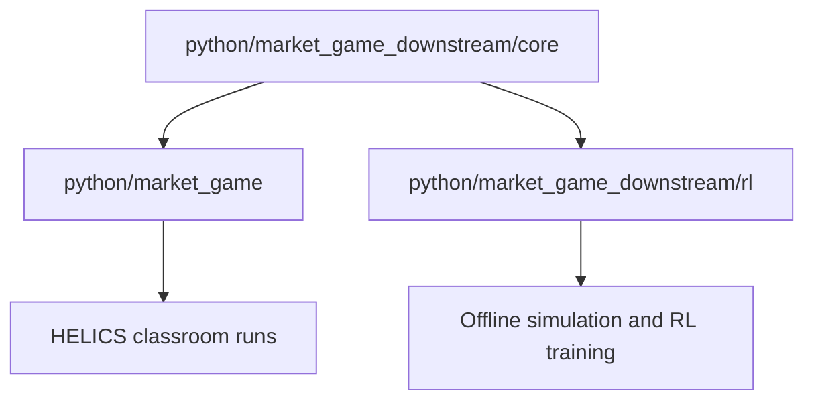

# Market Game Downstream Architecture

The implementation now has one shared rule layer and two adapters.

## Package Roles

| Package | Role |
|---|---|
| `market_game_downstream.core` | Canonical pure-Python rules, battery limits, pricing, profiles, clamping, and episode simulation. |
| `market_game` | Canonical HELICS communication, house templates, local runner, plotting, and classroom/CTF-facing strategy shape. |
| `market_game_downstream.rl` | Policies, legal observations, Gymnasium adapter, RLlib training, and evaluation commands. |
| `market_game_downstream.tests` | Smoke, parity, scenario, export, and optional RLlib tests. |

See `rule_inventory.md` for the current map of duplicated rule behavior,
canonical downstream sources, and downstream-owned helpers.

## Compatibility

`market_game_downstream.core.step_market_hour(...)` is the canonical hourly transition.
The HELICS market maker, pure simulator, and RL environment all route through
that function for validation, battery updates, costs, totals, and next-price
calculation.

`market_game_downstream.core.MarketScenario` packages policies, profile, initial price, and
config for repeatable pure simulations.

RL code imports shared rules directly from `python.market_game_downstream.core`;
the old `market_game_downstream.rl.core` compatibility layer has been removed.

The original `House.compute_demand(...)` strategy API is the canonical
classroom/CTF-facing interface. It returns the market-facing load as a finite
numeric value; it is not limited to integers. RL-specific action abstractions,
including coarse discrete battery actions, belong downstream in simulator and
training adapters. The older `market_game_downstream.helics` runtime copy has
been retired; the remaining files are compatibility notes that point back to
`python/market_game`.

The old `market_game_downstream.helics` compatibility notes now live in
`docs/helics_compatibility.md` and `docs/game_rules.md`; there is no downstream
HELICS package.

`market_game_downstream.rl.agents.actions` owns semantic market actions emitted
by controllers. `market_game_downstream.rl.agents.action_spaces` owns learner
action spaces for RL/Gym adapters. The simulator and exported submissions still
see only market load values. Current learner action spaces cover the coarse
three-posture smoke baseline, integer battery deltas, and continuous normalized
battery deltas.

Learned inference belongs in `market_game_downstream.rl.agents.controllers`.
Those controllers own their feature extractor, vector model, and action decoder;
RLlib, optimizers, reward shaping, and checkpoint management remain in
`market_game_downstream.rl.training` and `market_game_downstream.rl.export`.
Controller memory belongs in `market_game_downstream.rl.agents.state` and is
passed through `MarketAgent.state`.

## Dependency Rule

`market_game_downstream.core` must stay standard-library only. Optional dependencies belong
in adapters:

| Dependency | Where it belongs |
|---|---|
| HELICS | `market_game` runtime only. |
| matplotlib | `market_game` plotting/assets only. |
| Gymnasium/numpy | `market_game_downstream.rl.envs.gym_env`. |
| Ray/Torch | `market_game_downstream.rl.training`. |
