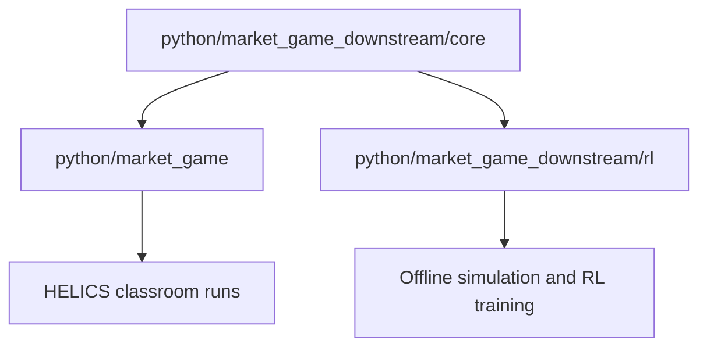

# Market Game Downstream Architecture

The implementation now has one shared rule layer and two adapters.

## Package Roles

| Package | Role |
|---|---|
| `market_game_downstream.core` | Canonical pure-Python rules, battery limits, pricing, profiles, clamping, and episode simulation. |
| `market_game` | Canonical HELICS communication, house templates, local runner, plotting, and classroom/CTF-facing strategy shape. |
| `market_game_downstream.rl` | Policies, legal observations, Gymnasium adapter, RLlib training, and evaluation commands. |
| `market_game_downstream.tests` | Smoke, parity, scenario, export, and optional RLlib tests. |

See `rule_inventory.md` for the current map of duplicated rule behavior,
canonical downstream sources, and downstream-only wrappers.

## Compatibility

`market_game_downstream.core.step_market_hour(...)` is the canonical hourly transition.
The HELICS market maker, pure simulator, and RL environment all route through
that function for validation, battery updates, costs, totals, and next-price
calculation.

`market_game_downstream.core.MarketScenario` packages policies, profile, initial price, and
config for repeatable pure simulations.

`market_game_downstream.rl.core.*` remains as a compatibility layer that re-exports shared
core objects. Existing commands and imports continue to work while new code can
import directly from `python.market_game_downstream.core`.

The original `House.compute_demand(...)` strategy API is still supported.
`python/market_game/house_template.py` also exposes `ActionHouse` and
`DeltaHouse` for students who want to choose battery actions or battery deltas
instead of raw market load. The older `market_game_downstream.helics` copy is
compatibility-only and should not be extended as a separate runtime surface.

## Dependency Rule

`market_game_downstream.core` must stay standard-library only. Optional dependencies belong
in adapters:

| Dependency | Where it belongs |
|---|---|
| HELICS | `market_game` runtime only. |
| matplotlib | `market_game` plotting/assets only. |
| Gymnasium/numpy | `market_game_downstream.rl.envs.gym_env`. |
| Ray/Torch | `market_game_downstream.rl.training`. |
