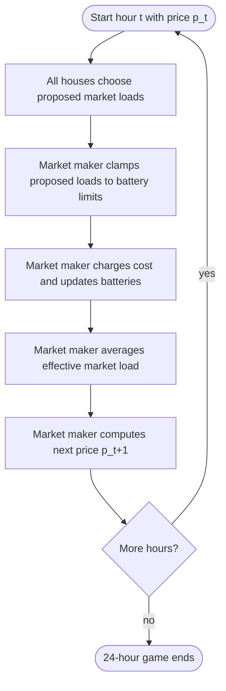
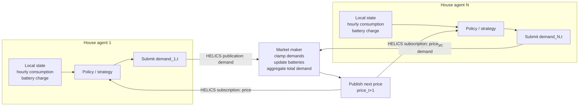

# Market Game Rules

This page is the canonical short reference for the market rules used by both
the HELICS game and the fast RL simulator.

## Hourly Timing



The initial hour starts with `p_0 = 0.5`. After that, the price lags by one
hour:

```text
For each house i:
  proposed_load_i,t = base_demand_i,t + battery_delta_i,t
  market_load_i,t = clamp(proposed_load_i,t)
  cost_i,t = p_t * market_load_i,t
  battery_i,t+1 = battery_i,t + market_load_i,t - base_demand_i,t

For the market:
  average_market_load_t = (sum over houses of market_load_i,t) / N
  p_t+1 = price_rule(average_market_load_t)
```

So a house pays `p_t` for its current-hour market load `L_i,t`, while that same
load helps determine the price everyone sees next hour.

## HELICS Interface

This is the runtime interface between house agents and the market maker. Each
house keeps its own demand profile, battery state, and strategy. HELICS carries
only the published price and the submitted market load.



In code, the house strategy is the `compute_demand(...)`, `choose_action(...)`,
or `choose_delta(...)` method. The market maker does not call those methods
directly; it only receives each house's submitted demand through HELICS.

## Battery Rules

| Rule | Value |
|---|---:|
| Starting charge | `0` kWh |
| Capacity | `20` kWh |
| Max charge per hour | `5` kWh |
| Max discharge per hour | `10` kWh |

The template clamps invalid choices back into the legal battery range so the
round can continue.

The current downstream notes on invalid-demand consequences and the known
clamp-order edge case live in
`../../docs/invalid_demand_behavior.md`.

## Market Load

Each house has a base demand for the current hour:

```text
market_load = base_demand + battery_delta
```

| Battery action | `battery_delta` | Market effect |
|---|---:|---|
| Charge | Positive | Buy more than base demand. |
| Neutral | `0` | Buy exactly base demand. |
| Discharge | Negative | Buy less than base demand. |

Negative market load is allowed when the battery has enough stored energy.

## Pricing Rule

The market maker computes average market load:

```text
M = total_market_load / number_of_houses
```

Then it computes the next price:

| Average load `M` | Price |
|---:|---:|
| `M < 3.0` | `0.10` |
| `3.0 <= M < 6.0` | `0.10 + 0.03 * (M - 3.0)` |
| `6.0 <= M < 9.0` | `0.19 + 0.10 * (M - 6.0)` |
| `9.0 <= M < 13.0` | `0.49 + 0.25 * (M - 9.0)` |
| `M >= 13.0` | `1.49 + 1.00 * (M - 13.0)` |


## Legal Information

| Information | Available to a house? |
|---|---|
| Current price | Yes |
| Current hour | Yes |
| Own battery charge | Yes |
| Own full demand profile | Yes |
| Own price history | Yes |
| Other houses' actions | No |
| Other houses' batteries | No |
| Other houses' code | No |
| Same-hour aggregate load | No |

Strategies may infer delayed aggregate behavior from price history, but they
should not use hidden simulator diagnostics as policy inputs.

## Core Transition Model

Both HELICS and RL use the same shared transition:

```text
proposed market_load
  -> clamp to battery limits
  -> effective market_load
  -> update battery
  -> charge hourly cost
  -> compute next price
```

Diagnostics may report both proposed and effective load. The effective load is
what affects battery state, cost, total market load, and the next price.
