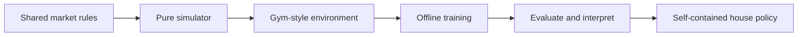

# RL Training Workflow

The RL path trains against the same market rules as the HELICS game, but avoids
HELICS during training so episodes are fast and repeatable.

## Workflow



## Simulator Vs HELICS

| Path | Best for |
|---|---|
| `python.market_game_downstream.core.run_episode` | Fast parity checks and fixed-policy evaluation. |
| `MarketGameEnv` | Single-learner RL episodes without Gymnasium dependency. |
| `GymMarketGameEnv` | Gymnasium/RLlib-compatible training. |
| HELICS `market_game` | Final integration and classroom game runs. |

The simulator preserves the original timing: the current hour's aggregate load
determines the next hour's price. Hidden aggregate values are diagnostics only,
not legal policy inputs.

## Observation Modes

| Mode | Includes |
|---|---|
| `local` | Hour, current price, own battery, current base demand. |
| `price_history` | Local features plus recent price summaries. |
| `inference` | Price history plus delayed aggregate-load inference features. |

Use `price_history` as the default training mode. It is the clearest baseline
and avoids making aggregate-inference math part of the first experiment.
`inference` is an advanced mode; for feature definitions, see
`reference/features.md`.

## Training Smoke Run

```bash
python3 -m python.market_game_downstream.rl.training.train_rllib --iterations 1 --observation-mode price_history
```

This command verifies that RLlib can collect complete 24-hour episodes. It is
not evidence that the resulting policy is strong.

Terminal battery penalties are optional. Use them when training should prefer
ending near a target battery state, for example in repeated-day experiments
where ending full or empty changes the next day's value.

## Deployment Constraint

Assume the final game runner executes only a submitted Python strategy file.
Prefer one of these deployment forms:

| Form | Notes |
|---|---|
| Distilled heuristic | Most robust; convert learned behavior into readable rules. |
| Embedded tiny policy | Acceptable if all weights/constants are literal Python data. |
| External checkpoint | Avoid unless explicitly allowed. |
| Runtime training | Avoid for classroom or closed-VM runs. |
